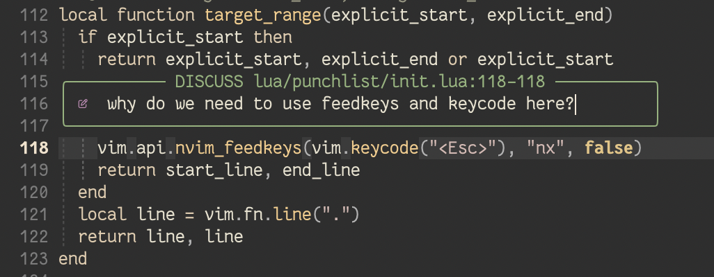
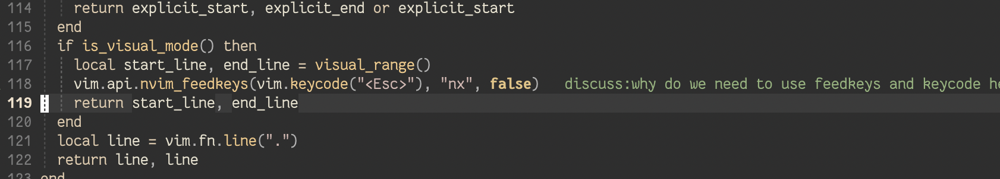
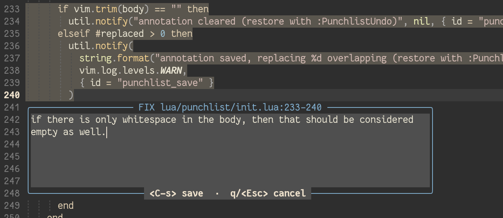
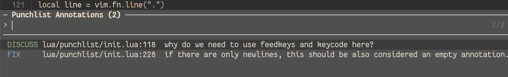
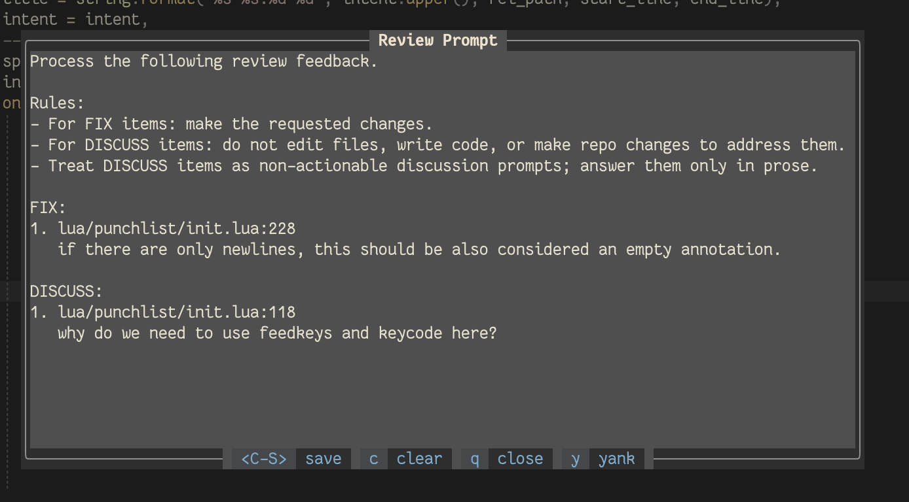

# punchlist.nvim

When reviewing code, it's helpful to make annotations that live outside the
code itself -- like comments in a Microsoft Word document. This is a plugin to
do that in neovim.

This is useful for providing feedback to others, especially on a shared system
(like an HPC cluster) or for asking questions and giving feedback to an AI
agent while reviewing the code it creates.

The idea is you make annotations that are tied to lines or ranges of lines,
like how comments work in Microsoft Word. Glyphs in the gutter show where they
are, and virtual text (like the text shown by LSP tools in nvim) display the
text. As you edit, the annotations move with the text thankjs to nvim's extmark
system. If you edit a bit too much and the extmarks get confused, you can
re-anchor or cut-and-paste annotations (I wish you could do this with Word
docs).

The annotations for all files in a repo or working directory are stored in
`.punchlist/annotations.json`, so you can send that file along with the code
you annotated to someone else with this plugin, and they can see (and edit) the
annotations.

There are commands for clearing them all, searching among them across files,
and composing a prompt you can edit and paste into an agent harness -- see
below.

Originally inspired by
[plannotator](https://github.com/backnotprop/plannotator) and
[pi-slopchop](https://github.com/robzolkos/pi-slopchop), but this is
nvim-native and not tied to any agentic AI...though you can certainly use it
with agentic AI.

## Screenshots

Adding an annotation for discussion:




After editing, it shows up as virtual text:




Can use multi-line entry for longer annotations, and annotations can be attached to multiple lines:



List of annotations to navigate among:



Pre-created prompt for targeted AI agent review, copy to clipboard with `y`:




## Some alternatives

...and how this plugin is different:

- VSCode has plugins like [Out-of-Code
  Insights](https://marketplace.visualstudio.com/items?itemName=JacquesGariepy.out-of-code-insights)
  offer similar functionality, and can even have threaded conversations. However this does not
  work well in a terminal-native enviroment like this plugin does.
- GitHub/GitLab web interface: push your code to GitHub/GitLab, create a pull
  request, use GitHub commenting features to discuss in the PR. This is a very
  awkward workflow, which this plugin avoids entirely.
- [revdiff](https://github.com/umputun/revdiff) is a command-line tool with
  similar features, but requires working outside of nvim, and doesn't support
  simultaneous editing. This plugin lets you work with and edit your code *while*
  making comments.
- Agent plugins like [plannotator](https://github.com/backnotprop/plannotator)
  and [pi-slopchop](https://github.com/robzolkos/pi-slopchop) have similar
  functionality, but they are very AI-agent centric and don't really support
  simultaneous editing. This plugin does have a convenient way of providing
  a prompt to an agent but that's just a bonus. This plugin is nvim first, ai second.
- nvim plugins like
  [annotate.nvim](https://github.com/hugooliveirad/annotate.nvim) and
  [murmur](https://github.com/piqusy/murmur) come close, but lack the ability
  to put an annotation in the right place after it has drifted due to edits.
- [Delta](https://zed.dev/blog/introducing-delta) takes all of this to the next
  level, but at the time of this writing it appears it will be a separate app

## Install

Requires Neovim 0.11+.

With [lazy.nvim](https://github.com/folke/lazy.nvim):

```lua
{
  "daler/punchlist.nvim",
  dependencies = { "folke/snacks.nvim" },
  config = function()
    -- vim.g.maplocalleader = " " -- set this *before* setup() if you rely on it
    require("punchlist").setup({})
  end,
}
```


`maplocalleader` (by default, `\` (backslash)) needs to be configured *before*
this plugin is loaded.

## How it works

Comments are stored per git repo (falling back to cwd if you're not in a repo)
in a hidden `.punchlist/annotations.json` file at the repo root (i.e. where the
`.git` directory is). Add `.punchlist/` to your `.gitignore` if you don't want
it showing up in `git status`:

```
echo '.punchlist/' >> .gitignore
```

`comments.json` is written pretty-printed with sorted keys, so it's reasonable
to hand-edit or diff if you need to.

It's also re-read whenever it changes underneath the session (another Neovim
instance, a `git checkout`, or an agent rewriting it).


## Add an annotation

There are two kinds of annotations:

- `FIX` -- something needs to be changed. Add to the current line or selection
  with `:PunchlistFix`, by default mapped to `<localleader>pf`.
- `DISCUSS` -- don't change, just a point of discussion. Use `:PunchlistDiscuss` or
  `<localleader>pd`.

This will show a one-line box to add the comment to. If you want more room to
write, use `<C-o>` to change to a multi-line editor. `<C-s>` to save the
comment, `<Esc>` to cancel.

Files with comments show glyphs in the sign column (`▶`/`▲` for fix/discuss
line comments, `│` marking the rest of a multiline range) plus a preview
of the comment text at end of line (see config to change this).

## Edit an annotation

With the same line or selection, use the same command as when you added it to
edit the annotation.

## View an annotation

Use `:PunchlistPeek` or `<localleader>pp` to "peek" at an existing annotation. 

## Re-anchoring a stale or orphaned annotation

This plugin uses nvim's
[extmarks](https://neovim.io/doc/user/api/#_extended-marks) system. Extmarks
are annotations that track text changes in a currently-open buffer. Adding an
annotation adds an extmark. At the same time, it we capture a hash of the line
at annotation time. This lets us flag annotations that have changed, say, if
the file was edited externally.

If you add a FIX or DISCUSS annotation, and then start editing, the extmarks
system lets us keep track of where the annotation should move. But if there are
too man changes and the extmarks can't work out where the annotation should be,
it will be marked `stale`. Or if the corresponding lines are deleted, it will
be marked `orphaned`. Note that even adding a single character to a line with
an existing annotation will mark it stale. That's because a single character
changes the hash, so the annotation is technally no longer annotating what it
originally was.

You can "re-anchor" a `stale` or `orphaned` annotation with
`:PunchlistReanchor`, which is mapped to `<localleader>pr` by default. This
says, "the annotation stands, but it should now apply here". By the way if you
only edit a stale annotation (and don't reanchor it), it will stay stale.
That's because it's interpreted as "this edited annotation applies the line as
it originally was". You'll need to reanchor stale/orphaned annotations.

If you make a selection within a stale annotation, you can re-anchor just to
that location.

Sometimes you edit so much that reanchoring doesn't make sense any more. In
that case you can cut and paste an annotation with `:PunchlistCut` and
`:PunchlistPaste`. These are mapped to `<localleader>px` and `<localleader>pv`
respectively (mnemonic is Cmd-x and Cmd-v for macOS cut and paste). You can
paste an annotation in any other file that you open, it doesn't have to be in
the same one.


## Overall operations

Use `:PunchlistList` (`<localleader>pV`) to get a picker where you can search
for and jump to annotations.

Within this window you can use the following actions:

| Keymap  | Action                                                       |
|---------|--------------------------------------------------------------|
| `<CR>`  | Jump to the comment                                          |
| `<Tab>` | Select/deselect a row                                        |
| `<C-x>` | Delete the selection (or the row under the cursor), in place |
| `<A-b>` | Toggle scoping the list to the current file                  |

Two preview styles, via the `list_preview` config option:

- `"body"` (default) -- a preview pane with the full comment body. Best for
  "what did I actually write".
- `"file"` -- ivy layout with `preview = "main"`: the real editor window
  scrolls to follow the selection. Best for walking through everything you
  flagged.

Use `:PunchlistClear` (`<localleader>pc`) to clear all annotations (you'll be
asked for confirmation).

Use `:PunchlistPrompt` (`<localleader>ps`) to get a prompt ready to paste into
an arbitrary agent (inspired by the pi-slopchop plugin for Pi). You can edit it
further in this window. See the shortcuts at the bottom of that window -- `y`
to yank to clipboard; `c` to clear annotations, `q` to quit. For stale/orphaned
comments that you haven't fixed yet, the information on where they came from is
still captured and added to the prompt. So an LLM might still be able to figure
it out, but you'll get better results if you fix them with reanchoring or cut
& paste.

Use `:PunchlistUndo` (`<localleader>pu`) to restore the most recent delete. You
can do this for up to the last 20 deleted anntations. Operations that destroy
several comments at once, like a multi-select delete in the picker or a range
annotation that overlaps multiple existing annotations, are restored as
a group. Note that cut-and-paste is not currently undoable.

## Default keymaps

All defaults live under the `<localleader>p` prefix so they stay out of the
way of other plugins (and of any other `<localleader>...` mappings you
already have). Set `default_keymaps = false` in `setup()` to define your own
around the functions in `lua/punchlist/init.lua` instead.

For example: visually select a few lines and press `<localleader>pf` to leave
a FIX comment on the range, `<localleader>p]` / `<localleader>p[` to hop
between commented lines afterward, and `<localleader>ps` once you're done to
compile everything into a prompt.

| Keymap            | Mode | Command              | Action                                              |
|-------------------|------|----------------------|-----------------------------------------------------|
| `<localleader>pf` | n, v | `:PunchlistFix`      | Add/edit a FIX comment on the line or selection     |
| `<localleader>pd` | n, v | `:PunchlistDiscuss`  | Add/edit a DISCUSS comment on the line or selection |
| `<localleader>pp` | n    | `:PunchlistPeek`     | Peek at the full comment body on this line          |
| `<localleader>pX` | n    | `:PunchlistDelete`   | Delete the comment on the current line              |
| `<localleader>pu` | n    | `:PunchlistUndo`     | Restore the most recently deleted comment(s)        |
| `<localleader>p]` | n    | `:PunchlistNext`     | Jump to the next commented line                     |
| `<localleader>p[` | n    | `:PunchlistPrev`     | Jump to the previous commented line                 |
| `<localleader>pV` | n    | `:PunchlistList`     | List every comment in the repo (snacks picker)      |
| `<localleader>px` | n    | `:PunchlistCut`      | Cut this comment, to paste somewhere else           |
| `<localleader>pv` | n, v | `:PunchlistPaste`    | Paste the cut comment here (v: onto the selection)  |
| `<localleader>ps` | n    | `:PunchlistPrompt`   | Compile + save + yank the review prompt             |
| `<localleader>pt` | n    | --                   | Toggle the inline comment text                      |
| `<localleader>pr` | n, v | `:PunchlistReanchor` | Reanchor this comment (v: onto the selection)       |
| `<localleader>pc` | n    | `:PunchlistClear`    | Clear all comments in this repo                     |

Inside the multiline comment editor:

| Keymap        | Action                     |
|---------------|----------------------------|
| `<C-s>`       | Save the comment and close |
| `q` / `<Esc>` | Discard and close          |

Inside the one-line prompt:

| Keymap        | Action                           |
|---------------|----------------------------------|
| `<CR>`        | Save the comment and close       |
| `<C-o>`       | Escalate to the multiline editor |
| `<Esc>` / `q` | Discard and close                |

Leave the body empty and save to delete an existing comment.


## Configuration

You only need to specify in your config if you want something different than
these defaults:

```lua
require("punchlist").setup({

  -- directory (relative to git root, or cwd if not git repo) and files
  data_dir = ".punchlist",
  comments_file = "comments.json",
  prompt_file = "prompt.txt",

  -- see table above
  default_keymaps = true,

  -- default_keymaps = false,
  -- Then define your own, e.g. bound to the :Punchlist* commands (or call
  -- the functions in lua/punchlist/init.lua directly):
  -- vim.keymap.set("n", "<leader>pf", ":PunchlistFix<CR>")

  -- Glyphs shown in the gutter on the left
  glyphs = {
    fix = "▶",
    discuss = "▲",
    continuation = "│",
    stale = "!",
    orphaned = "x",
    cut = "/",
  },

  -- Highlight groups used for the components
  highlights = {
    fix = "DiagnosticInfo",
    discuss = "DiagnosticOK",
    continuation = "Comment",
    stale = "DiagnosticWarn",
    orphaned = "DiagnosticError",
    cut = "DiagnosticHint",
    virtual_text_fix = "DiagnosticInfo",
    virtual_text_discuss = "DiagnosticOK",
    pending_range = "Visual",
  },

  -- Master switch for the line-tracking system (see "How it works" above).
  line_tracking = true,
  virtual_text = true,

  -- Add this to the beginning of the virtual text
  virtual_text_prefix_fix = "  fix:",
  virtual_text_prefix_discuss = "  discuss:",

  virtual_text_max_len = 60,

  -- "below" (virt_lines with the full body), or any nvim virt_text_pos:
  -- "eol", "eol_right_align", "right_align", "inline", "overlay"
  virtual_text_pos = "eol",

  -- layout of the list from :PunchlistList. "body" shows the contents of each
  -- annotation; "file" autojumps the buffer immediately upon selection
  list_preview = "body", -- or "file"

  -- Both of these are snacks.win configs, merged over the defaults below.
  float = {
    relative = "cursor",
    row = 1,
    col = 0,
    width = 0.5,
    height = 6,
    min_width = 40,
    border = "rounded",
    backdrop = false,
    resize = true,
  },
  peek = {
    relative = "cursor",
    row = 1,
    col = 0,
    width = 0.5,
    height = 12,
    min_width = 40,
    border = "rounded",
    backdrop = false,
  },
  -- Instruction header prepended to the composed FIX/DISCUSS prompt.
  -- Overriding one key (e.g. `fix`) replaces that whole line list rather
  -- than merging line-by-line.
  prompt_headers = {
    both = { "Process the following review feedback.", "..." },
    fix = { "Address the following review feedback by making the requested changes.", "" },
    discuss = { "Respond to the following review discussion items in prose only.", "" },
  },
})
```


## Troubleshooting

`:checkhealth punchlist` verifies the Neovim version, that snacks.nvim is
loaded with the modules this plugin uses, that the data directory is writable,
how many comments are stored for the current repo, and whether the data
directory is gitignored.


## AI disclosure

Opus 5 and Sonnet 5 wrote much of the initial code, followed by extensive
manual editing and many iterations with the model(s). The entire README was
written manually, as well as most of the comments (I'm not a big fan of LLM
prose). All code was manually reviewed.
